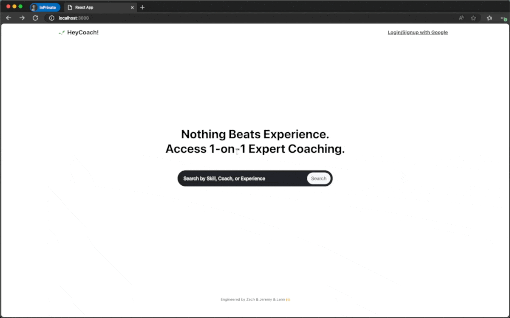

# 🌱 HeyCoach!

## Overview
**HeyCoach! eliminates the frustration & friction of finding and scheduling personalized coaching sessions .**  
1. It is a discovery platform for coaches and coachees to connect and schedule sessions. 
2. Coaches can create accounts and list their services
3. Coachees can search for coaches and book sessions
4. The platform also handles payments for sessions, with coaches receiving direct payments from coachees.

#### ⭐️ Key Features

- **Seamless Account Creation**: Integrated Google Authentication for streamlined user sign-up and sign-in processes.
- **Automated Coach Compensation**: Integrated Stripe API for the creation of coach accounts to facilitate direct payments, managed at the point of account creation.
- **Simplified Payments for Coachees**: Enabled easy payment processing for coachee transactions via Stripe, without the need for account setup.
- **Integrated Insta Marketing for Coaches**: Integrated Instagram API for coaches. Their profile page will then display their 4 most recent instagram posts to potential coachees. 
- **Discovery and Search Functionality**: Developed a search interface with filters for coach discovery, complemented by detailed coach profiles and user-generated reviews.
- **Efficient Booking System**: Designed a user-friendly booking interface with integrated calendar functionality for convenient scheduling.
- **Synthetic Data Generation for Testing**: Utilized FakerJS within an initmongo.js script for the creation of mock accounts and session data to test system robustness.
- **Data Security and Query Efficiency**: Employed MongoDB in tandem with GraphQL to execute efficient data queries, ensuring a separation of sensitive and general data.
- **Engaging User Experience**: Adopted React for dynamic component-based UI/UX design, with Bootstrap and custom CSS to match the original Figma design specifications. See [UIUX Planning](./archive/HeyCoach-SolutionArchitecture.pdf)
- **Advanced Navigation and State Management**: Implemented React Router for seamless navigation and used React context, hooks, and local storage for state persistence.
- **Session Management Interface**: Created interactive modals for real-time session management by coaches.

  
#### 🥪 Technology Stack and APIs:

- Database: MongoDB
- Server: Node.js with Express framework
- Frontend: React, including React Router for routing
- API Layer: GraphQL
- Styling: Bootstrap for responsive design, complemented with custom CSS
- Payment Processing: Stripe API for dual (coach and coachee) transaction handling
- Authentication: Google Auth API for secure logins
- Marketing: Instagram API for coach profile pages to show their latest insta posts
- Local Storage: Browser's local storage for maintaining session states

#### 📦 Deployment and Bundling:
- Application bundling and optimization handled through Webpack.

---

## Interim Notes

#### Design:

1. Visually appealing/intuitive UI elements.
2. Clean and uniform color scheme/contrast/positioning.
3. Intuitive user journey flow and navigation experience.

#### Styling:

1. Use of bootstrap/custom CSS for unique look and feel.

#### Redirection:

1. No broken links.

#### Documentation:

1. Commented codebase

#### List of front-end features (for now):

1. Search for courses/lessons/sessions without signing in
2. Login/Signup page and input verification logic
3. Courses/lessons/sessions filtering through topic
   - filtering modal is screen size aware through media queries, and can show/disappear according to the position of mouse click
4. Coach profiles with testimonials and social feeds
5. Bookings page with session datetime picker using a calendar

---

## Available Scripts

In the project directory, you can run:

### `npm install`

Installs the project dependencies.

### `npm start`

Runs the app in the development mode.\
Open [http://localhost:3000](http://localhost:3000) to view it in your browser.

The page will reload when you make changes.\
You may also see any lint errors in the console.
